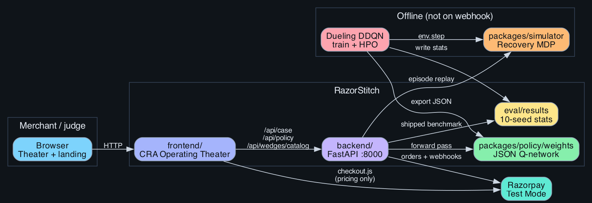
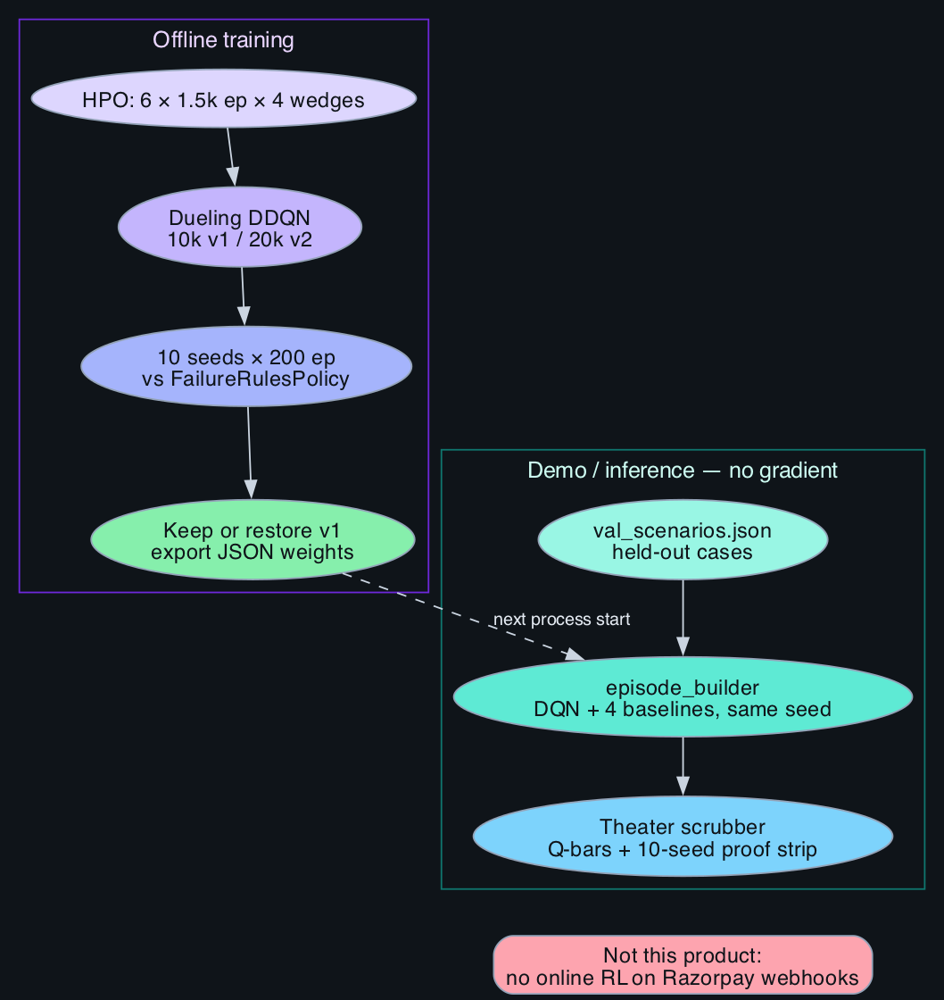

# RazorStitch

RazorStitch is an RL payment-recovery system for Razorpay merchants. Four Dueling Double-DQN agents decide when to wait, send a payment link, nudge, or stop after a failed checkout, abandoned cart, failed subscription, or overdue invoice. Training happens in a simulator. The website replays the **shipped** checkpoints on held-out validation cases and shows the **10-seed benchmark** from `eval/results` (not decorated marketing numbers).

GitHub: [https://github.com/Siva-Sainath/Razorstich](https://github.com/Siva-Sainath/Razorstich)

## What it solves

A failed payment is a sequence, not a retry button. Blast SMS and you burn trust and duplicate UPI collections. Do nothing and the rupees never come back. RazorStitch optimizes **net recovered INR** under a three-contact trust budget, then lets a merchant watch the same policy decide on a real validation episode.

## Shipped simulator results

Protocol: **10 seeds (42–51) × 200 episodes**, Dueling DDQN vs `FailureRulesPolicy`. Metric: mean net recovered INR. These are simulator figures, not live merchant uplift.

| Scenario | Shipped model | Mean net ₹/seed | Failure-rules ₹/seed | Lift | Seeds |
|---|---|---:|---:|---:|---|
| Checkout failed (72h) | v2 | 516,614 | 320,532 | **+61.2%** | 10/10 |
| Cart abandon (48h) | v1 (v2 rolled back) | 558,302 | 179,763 | **+210.6%** | 10/10 |
| Subscription failed (14d) | v1 (v2 rolled back) | 453,353 | 262,697 | **+72.6%** | 10/10 |
| Invoice overdue (30d) | v2, parity review | 497,263 | 218,627 | **+127.4%** | 10/10 |

Checkout 95% CI does not overlap the rules baseline (policy ₹515,369–517,939 vs rules ₹319,363–321,456). HPO was 6 × 1,500-episode trials per wedge (24 total) before the 20k v2 train. Cart and subscription v2 lost to v1, so `train_all_wedges.py` restored v1 weights — the demo displays those restored numbers.

Artifacts: [`eval/results/tables.md`](eval/results/tables.md), [`eval/results/benchmark_*_stats.json`](eval/results/), [`eval/baselines/v1/`](eval/baselines/v1/).

## Architecture





- **Theater (`frontend/`)** — CRA demo: scrubber, Policy Brain Q-bars, ghost baselines, research dashboard.
- **API (`backend/`)** — FastAPI. `/api/case/{id}` builds a replay from the shipped JSON weights. `/api/policy/recommend` scores the current tick. `/api/wedges/catalog` exposes the 10-seed stats the landing page prints.
- **Simulator (`packages/simulator/`)** — MDP gym. Hidden customer-response model. Action masks (UPI cooldown, trust budget).
- **Policy (`packages/policy/`)** — Dueling DDQN train/eval, JSON weight export. Node/TS matmul for serverless inference.
- **Razorpay Test Mode** — proves checkout.js + webhooks. **Not** the training gym.

Sources: [`docs/architecture/src/system.dot`](docs/architecture/src/system.dot), [`docs/architecture/src/rl-loop.dot`](docs/architecture/src/rl-loop.dot).

## Demo (replay)

```bash
# API
cd backend
python3 -m venv ../.venv && source ../.venv/bin/activate
pip install -r requirements.txt
uvicorn server:app --reload --port 8000

# first case warms the DQN rollout cache
curl http://localhost:8000/api/case/VAL-CHK-004

# site
cd ../frontend
cp .env.example .env   # REACT_APP_BACKEND_URL=http://localhost:8000
npm install
npm start
```

Open [http://localhost:3000/checkout?record=1](http://localhost:3000/checkout?record=1).

| Key | Action |
|-----|--------|
| Space | Play / pause |
| ← → | Step events |
| G | Overlay baseline paths (same seed as DQN) |

The proof strip, landing cards, and research walkthrough read `acceptance.mean_improvement_pct` and per-seed nets from the eval JSON. Ghost paths are actual baseline rollouts on **that validation seed**, not scaled probabilities.

## Train (optional)

```bash
source .venv/bin/activate
pip install -e .
python -m packages.policy.train.run --wedge checkout_failed --train --benchmark --seed 42
```

See [`docs/TRAINING.md`](docs/TRAINING.md) and [`docs/RL_ARCHITECTURE.md`](docs/RL_ARCHITECTURE.md).

## Layout

```
frontend/              Operating Theater, landing, /research, pricing
backend/               FastAPI: cases, policy, Razorpay Test checkout
packages/simulator/    Recovery MDPs + val_scenarios.json
packages/policy/       DQN, baselines, exported weights
eval/results/          10-seed stats, curves, HPO, train_v2_summary.json
eval/baselines/v1/     Restored checkpoints for cart + subscription
docs/architecture/     Diagrams
```

## Honesty

- Lift numbers are **simulator** vs failure-rules. Do not quote them as production GMV lift.
- Always-payment-link can win on gross recovery %; the agents optimize **net** INR (comms, friction, duplicate penalty).
- Razorpay Test Mode captures are a separate label from simulated recovery.

## License

Razorpay and third-party SDKs remain under their own terms.
